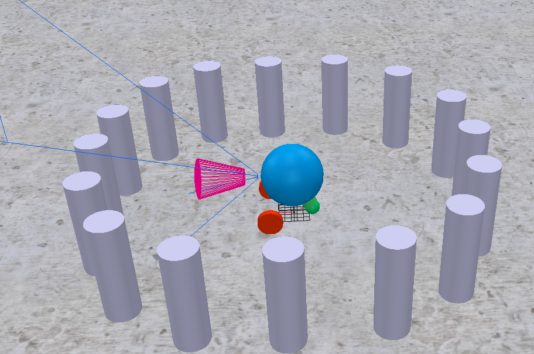

# BubbleRob Steuerung mit CoppeliaSim und Python-GUI



## Projektübersicht

Dieses Projekt demonstriert die Steuerung eines mobilen Roboters (BubbleRob) in der Simulationsumgebung CoppeliaSim über eine Python-GUI. Die Kommunikation erfolgt über die ZeroMQ Remote API.

---

## Zielsetzung

- Steuerung eines zweirädrigen Roboters in CoppeliaSim
- Entwicklung einer benutzerfreundlichen GUI mit PySide6
- Echtzeitkommunikation zwischen Python und CoppeliaSim

---

## Technologien

| Komponente | Technologie |
|------------|-------------|
| GUI | PySide6 (Qt für Python) |
| Simulation | CoppeliaSim Edu |
| API | ZeroMQ Remote API |
| Programmiersprache | Python 3 |

---

## Dateien

- **gui_1.py** - Basis-GUI mit Start/Stop Funktionalität
- **gui_2.py** - Erweiterte GUI mit Richtungssteuerung
- **bubbleRob_GUI.ttt** - CoppeliaSim Szenendatei

---

## Installation

### Voraussetzungen
```bash
pip install PySide6 pyzmq cbor coppeliasim-zmqremoteapi-client