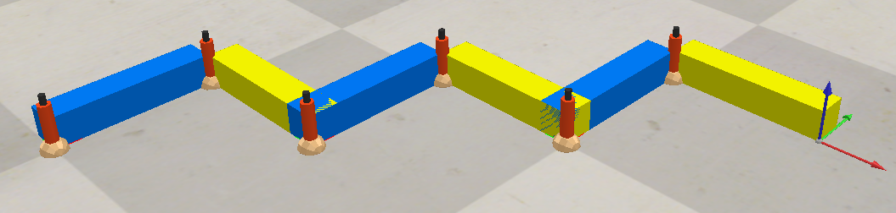

# Snake Robot Kinematik mit CoppeliaSim und Python



## Projektübersicht

Dieses Projekt implementiert die Vorwärtskinematik eines 6-DOF Schlangenroboters in CoppeliaSim. Die Berechnungen werden in Python durchgeführt und mit den Simulationsergebnissen verglichen. Die Kommunikation erfolgt über die ZeroMQ Remote API.

---

## Zielsetzung

- Implementierung von Rotationsdarstellungen (Euler-Winkel, Quaternionen, Rotationsmatrizen)
- Aufbau einer Transformationskette für einen Schlangenroboter
- Entwicklung einer generischen Vorwärtskinematik-Funktion
- Validierung der Ergebnisse durch Vergleich mit CoppeliaSim

---

## Technologien

| Komponente | Technologie |
|------------|-------------|
| Berechnungen | Python mit NumPy |
| Simulation | CoppeliaSim Edu |
| API | ZeroMQ Remote API |
| Transformationen | Transformations-Bibliothek |

---

## Dateien

- **Alkhatib_P2_Task1.py** - Rotationskonvertierungen (Quaternion ↔ Matrix ↔ Euler)
- **Alkhatib_P2_Task2.py** - Vorwärtskinematik für Schlangenroboter
- **euler_angle.ttt** - CoppeliaSim Szene für Task 1
- **snake_robot.ttt** - CoppeliaSim Szene für Task 2 & 3

---

## Installation

### Voraussetzungen
```bash
pip install numpy pynput transformations coppeliasim-zmqremoteapi-client