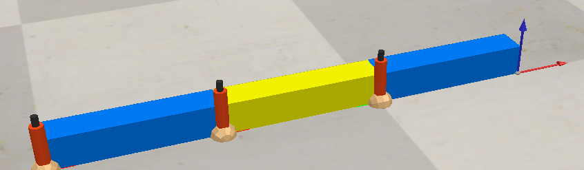

# Inverse Kinematik mit CoppeliaSim und Python




## Projektübersicht

Dieses Projekt implementiert die inverse Kinematik für planare Roboter mit zwei und drei Freiheitsgraden in CoppeliaSim. Für den 2-DOF-Roboter wird eine analytische Lösung verwendet, während der 3-DOF-Roboter mit einem numerischen Verfahren über die Jacobi-Matrix gesteuert wird.

---

## Zielsetzung

- Implementierung der analytischen inversen Kinematik für 2-DOF Roboter
- Implementierung der numerischen inversen Kinematik für 3-DOF Roboter
- Berechnung und Anwendung der Jacobi-Matrix
- Echtzeitsteuerung der Roboter über Tastatur in CoppeliaSim

---

## Technologien

| Komponente | Technologie |
|------------|-------------|
| Berechnungen | Python mit NumPy |
| Simulation | CoppeliaSim Edu |
| API | ZeroMQ Remote API |
| Steuerung | Tastatur-Interaktion |

---

## Dateien

- **Alkhatib_P3_Task1.py** - Analytische IK für 2-DOF Roboter
- **Alkhatib_P3_Task2.py** - Numerische IK für 3-DOF Roboter (Jacobi-Matrix)
- **2dof_robot.ttt** - CoppeliaSim Szene für Task 1
- **3dof_robot.ttt** - CoppeliaSim Szene für Task 2

---

## Installation

### Voraussetzungen
```bash
pip install numpy pynput transformations coppeliasim-zmqremoteapi-client