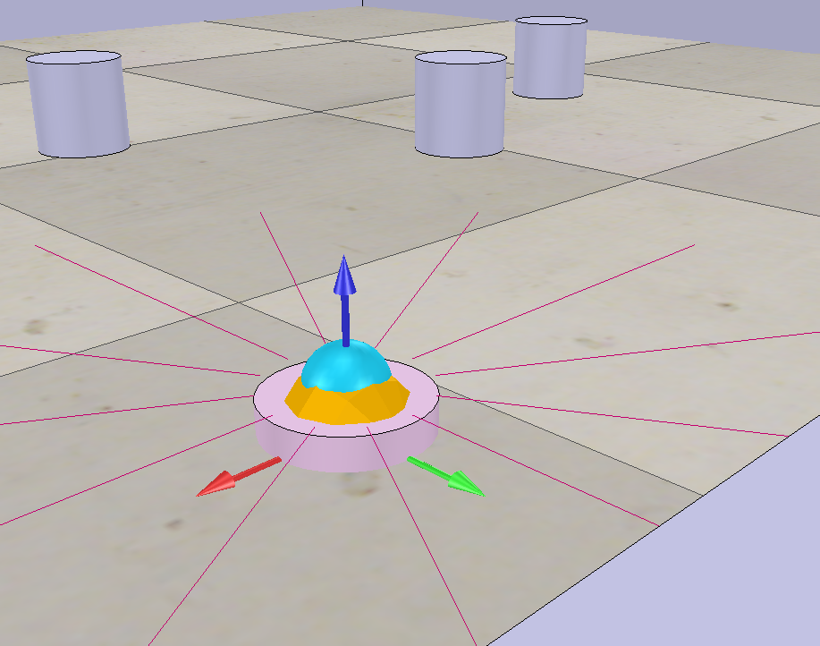

# Motion Planning mit Potentialfeld-Methode in CoppeliaSim



## Projektübersicht

Dieses Projekt implementiert eine Bewegungsplanung für einen 2D-Roboter (Bug) mit der Potentialfeld-Methode. Der Roboter bewegt sich zu einem Zielpunkt und weicht dabei Hindernissen aus. Die Simulation erfolgt in CoppeliaSim mit 12 Abstandssensoren.

---

## Zielsetzung

- Implementierung der Potentialfeld-Methode für die Bewegungsplanung
- Berechnung von Zielvektoren und Hindernisvermeidungsvektoren
- Echtzeitsteuerung eines Roboters in CoppeliaSim
- Kollisionsvermeidung mit repulsiven Kräften

---

## Technologien

| Komponente | Technologie |
|------------|-------------|
| Berechnungen | Python mit NumPy |
| Simulation | CoppeliaSim Edu |
| API | ZeroMQ Remote API |
| Steuerung | Potentialfeld-Methode |

---

## Dateien

- **Alkhatib_P_Bug_Task1.py** - Bewegung zum Ziel ohne Hindernisvermeidung
- **Alkhatib_P_Bug_Task2.py** - Bewegung mit Hindernisvermeidung (Potentialfeld)
- **Bug_P4.ttt** - CoppeliaSim Szene mit Bug-Roboter

---

## Installation

### Voraussetzungen
```bash
pip install numpy keyboard coppeliasim-zmqremoteapi-client