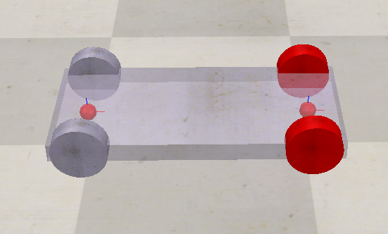

# Path Following mit CoppeliaSim und Python



## Projektübersicht

Dieses Projekt implementiert zwei Aufgaben zur Trajektorienverfolgung in CoppeliaSim. In Aufgabe 1 folgt ein Cuboid einer Bezier-Spline-Kurve. In Aufgabe 2 wird ein Fahrzeug mit Ackermann-Lenkung über eine GUI gesteuert.

---

## Zielsetzung

- Implementierung einer Bezier-Spline zur Bahnplanung
- Bewegung eines Körpers entlang einer Kurve mit korrekter Orientierung
- Entwicklung einer GUI zur Steuerung eines Ackermann-Fahrzeugs
- Realistische Lenkgeometrie für ein Fahrzeugmodell

---

## Technologien

| Komponente | Technologie |
|------------|-------------|
| Bahnplanung | Bezier-Spline (Python) |
| GUI | PySide6 (Qt für Python) |
| Simulation | CoppeliaSim Edu |
| API | ZeroMQ Remote API |
| Fahrzeugkinematik | Ackermann-Lenkung |

---

## Dateien

- **Alkhatib_P5_Task1.py** - Cuboid folgt Bezier-Spline
- **Alkhatib_Ackermann.py** - GUI-gesteuertes Fahrzeug mit Ackermann-Lenkung
- **bezier_path.py** - Bezier-Spline Bibliothek
- **Car_Cuboid.ttt** - CoppeliaSim Szene für Task 1
- **Wheel_Car.ttt** - CoppeliaSim Szene für Task 2

---

## Installation

### Voraussetzungen
```bash
pip install numpy PySide6 coppeliasim-zmqremoteapi-client