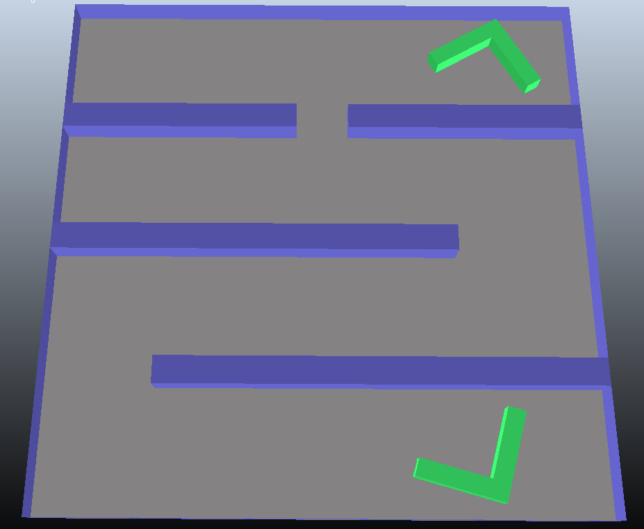
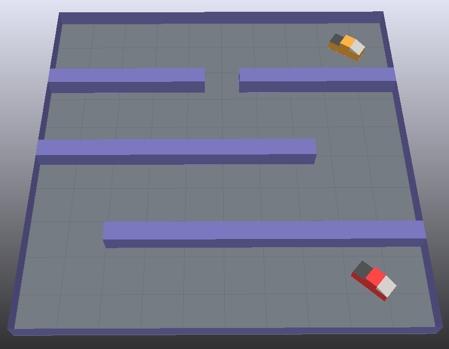

# Kollisionsfreie Pfadplanung mit OMPL in CoppeliaSim




## 📋 Projektübersicht

Dieses Projekt implementiert kollisionsfreie Pfadplanung für ein Fahrzeug in einer Labyrinth-Umgebung mit der Open Motion Planning Library (OMPL). Es werden zwei Szenarien betrachtet: holonome Bewegung (freie Translation und Rotation) und nicht-holonome Bewegung mit Dubins-Kinematik (Autokinematik).

---

## 🎯 Zielsetzung

- Implementierung der OMPL-Pfadplanung in CoppeliaSim
- Planung kollisionsfreier Pfade in einer Labyrinth-Umgebung
- Vergleich von holonomer und nicht-holonomer Bewegung
- Visualisierung der geplanten Pfade
- Ausführung der Pfade in der Simulation

---

## 🔧 Technologien

| Komponente | Technologie |
|------------|-------------|
| Pfadplanung | OMPL (Open Motion Planning Library) |
| Zustandsraum | Pose2D (holonom), Dubins (nicht-holonom) |
| Algorithmen | RRT, RRTConnect, RRT* |
| Simulation | CoppeliaSim Edu |
| API | ZeroMQ Remote API |

---

## 📁 Dateien

- **Alkhatib_P6_Task1.py** - Holonome Pfadplanung (Pose2D)
- **Alkhatib_P6_Task2.py** - Nicht-holonome Pfadplanung (Dubins)
- **holonomicPathPlanning3dof-python.ttt** - CoppeliaSim Szene für Task 1
- **nonHolonomicPathPlanning_wo_script.ttt** - CoppeliaSim Szene für Task 2

---

## 🚀 Installation

### Voraussetzungen
```bash
pip install numpy coppeliasim-zmqremoteapi-client